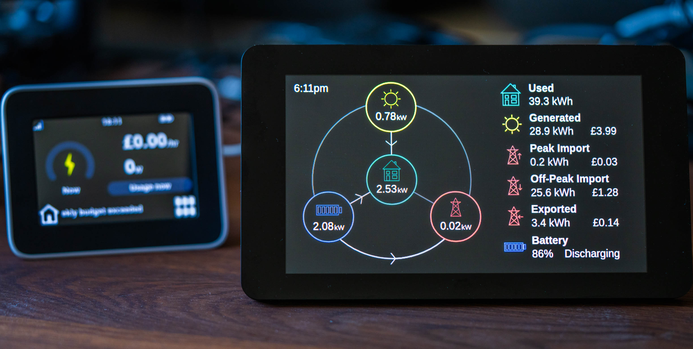
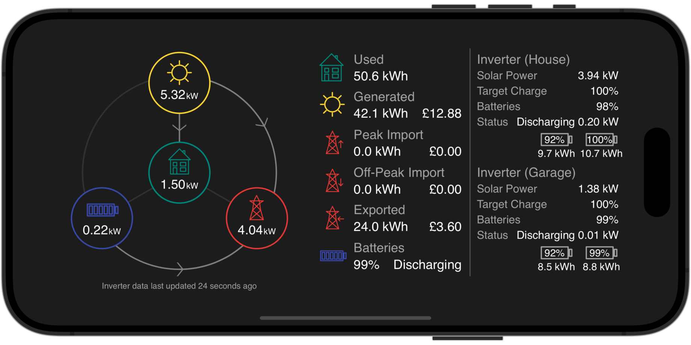
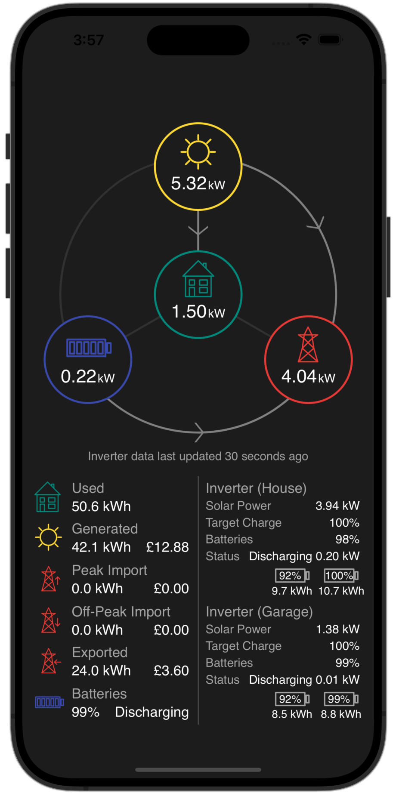

# GivEnergy Dashboard



## Introduction

This is a web-based application for showing a live summary of energy data from one or more GivEnergy inverters.

Data can be summarised if you are using a single inverter, or multiple inverters on a single phase, or multiple inverters
in a 3-phase environment.

It is designed to fetch its data from [GivTCP](https://github.com/britkat1980/giv_tcp), and is bundled within
recent versions of GivTCP.

## User interface



The user interface of the web app is rendered completely using SVG. The only external dependencies for the user interface
are a little use of jQuery. The rest of the app consists of pure JavaScript and CSS.

Data is obtained from the inverter by using REST requests to GivTCP on the local network.

The web app can run on a mobile, tablet, or desktop browser, and is designed to run in both portrait and landscape modes. 
It should render correctly on all devices/browsers. Let me know if you spot any rendering issues!



## Setup

This web app is bundled with recent versions of [GivTCP](https://github.com/britkat1980/giv_tcp).

1. Follow the installation instructions for [GivTCP](https://github.com/GivEnergy/giv_tcp) and set this up somewhere on 
   your local network so that it's running 24/7. This runs inside a Docker container.
2. When you configure GivTCP, you will need to set a few GivTCP parameters in the Docker Compose file in order to
   use this web app:
    1. `WEB_DASH` - set to `True` to enable this web dashboard.
    2. `WEB_DASH_PORT` - set it to the default port `3000`.
3. If you have multiple inverters and want the name of each inverter to be shown in the web app, you will also need to set 
   the following parameters:
    1. `INVERTOR_NAME_1` - a short friendly display name for the first inverter.
    2. `INVERTOR_NAME_2` - a short friendly display name for the second inverter, etc.

## Usage

The web app is accessed from the same network address as GivTCP, and will run on port 3000 by default. So you should be
able to launch the web app via `http://10.0.0.210:3000` (assumes `10.0.0.210` is the host where GivTCP is running).

You can append additional query-string parameters to show more advanced information:

- `ShowAdvancedInfo=true` - this will show/hide advanced information for each inverter, including individual battery state of charge.
  Defaults to `true`.
- `ShowTime=true` - will show/hide the current time in the top-left corner of the app - useful if you want to use this fullscreen
  on a tablet or mobile device.
  Defaults to `false`.
- `Hostname=` - this will let you override the hostname for GivTCP. Useful if you want to render this web app from a 
  different host than GivTCP. Defaults to using the same hostname as used in the browser.

For example, you can append these query-string parameters like this:

```
http://10.0.0.210:3000?ShowAdvancedInfo=true&ShowTime=true
```

## Other Notes

- SVG icons were designed and generated using https://yqnn.github.io/svg-path-editor/