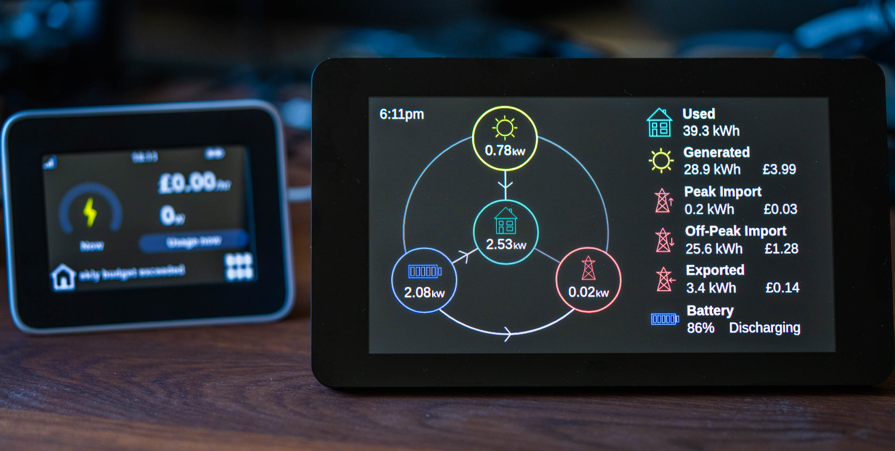
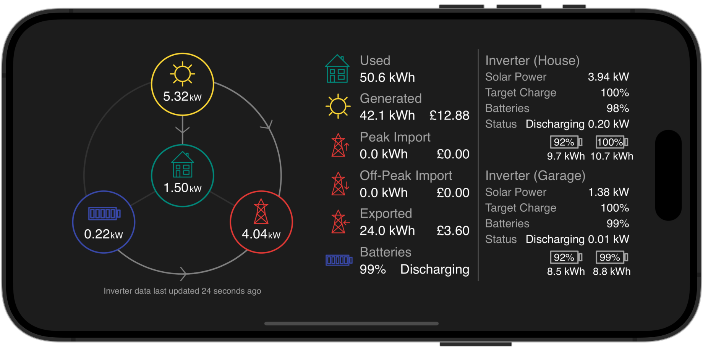
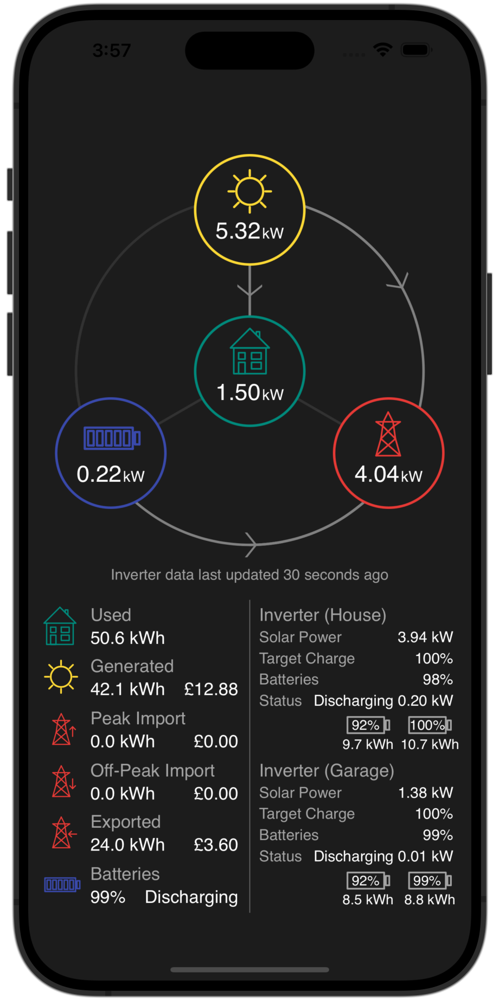

# GivEnergy Web Dashboard



## Introduction

This is a web-based application for showing a live summary of energy data from one or more GivEnergy inverters.

Data can be summarised if you are using a single inverter, multiple inverters on a single phase, or multiple inverters
in a 3-phase environment. The app should be able to summarise data from GivEnergy AC inverters, Hybrid inverters, All In One (AIO) systems,
Gateways, and the GivEnergy EV Charger (EVC).

It is designed to fetch its data from [GivTCP](https://github.com/britkat1980/giv_tcp), and is bundled within recent versions of GivTCP.

Note: The app doesn't provide a way to change configuration options for inverters - it only shows a summary of the inverter, 
power flows, and energy usage. It can be embedded in a Home Assistant dashboard view, or added to your phone's home screen
for quickly checking the state of your GivEnergy system and energy usage.

## User interface



The user interface of the web app is rendered completely using SVG. The only external dependencies for the user interface
are a little use of jQuery. The rest of the app consists of pure JavaScript and CSS.

Data is obtained from the inverter by using REST requests to GivTCP on the local network.

The web app can run on a mobile, tablet, or desktop browser, and is designed to run in both portrait and landscape modes. 
It should render correctly on all devices/browsers. Let me know if you spot any rendering issues!



## Setup

This web app is bundled with recent versions of [GivTCP](https://github.com/britkat1980/giv_tcp). 

GivTCP is usually installed by users in Home Assistant. Once installed, the web dashboard can be enabled via the GivTCP
config (the Web tab), and usually runs on port 3000 by default, e.g. `http://homeassistant.local:3000`.

## Usage

The web app is accessed from the same network address as GivTCP, and will run on port 3000 by default. So you should be
able to launch the web app via `http://homeassistant.local:3000` (assumes `homeassistant.local` is the host where GivTCP is running).

You can append additional query-string parameters to show more advanced information:

- `ShowAdvancedInfo=true` - this will show/hide advanced information for each inverter, including individual battery state of charge.
  Defaults to `true`.
- `ShowTime=true` - will show/hide the current time in the top-left corner of the app - useful if you want to use this fullscreen
  on a tablet or mobile device.
  Defaults to `false`.
- `Hostname=` - this will let you override the hostname or IP address for GivTCP. Useful if you want to render this web app from a 
  different host than GivTCP. Defaults to using the same hostname as used in the browser.
- `LightMode=true` - switches the app to a light theme with a white background and dark text.
  Defaults to `false` (dark mode).

For example, you can append these query-string parameters like this:

```
http://homeassistant.local:3000?ShowTime=true&LightMode=true
```

## Testing a downloaded copy against your GivTCP environment

This section explains how to test the latest version of the dashboard against your own live GivTCP setup, before the latest code is released as part of the main GivTCP project.

Your GivTCP instance needs to be running and reachable on your home network before you begin.

### Step 1 - Download the code

Click the green **Code** button near the top of this GitHub page, then choose **Download ZIP**. Once downloaded, extract the ZIP to a folder on your computer.

### Step 2 - Copy your settings into app.json

Open the `app.json` file (in the root of the extracted folder) in a text editor. It looks something like this:

```json
{
  "givTcpHosts": [
    { 
      "name": "House", 
      "port": "6345"
    }, {
      "name": "Garage",
      "port": "6346"
    }
  ],
  "solarRate": 0.306,
  "exportRate": 0.15
}
```

The easiest way to get the correct values is to open your existing GivTCP dashboard's `app.json` in a browser. If GivTCP is running in Home Assistant, go to:

```
http://homeassistant.local:3000/app.json
```

Copy the entire contents and paste them into the `app.json` file you opened in Step 2, replacing everything that was already there. Save the file.

Here is what each property means, for reference:

- **`givTcpHosts`** - one entry per inverter, each with a display name and the port GivTCP uses for that inverter. The default port is `6345`.
- **`solarRate`** - your solar generation/import rate in £/kWh.
- **`exportRate`** - your export rate in £/kWh.

### Step 3 - Start a simple web server

The dashboard has to be served over a local web server. Opening `index.html` directly from your file browser will not work.

The easiest way is to use Python, which comes pre-installed on Mac and most Linux systems. Windows users can download it for free from [python.org](https://www.python.org/downloads/).

Open a terminal (or Command Prompt on Windows), navigate to the folder you extracted in Step 1, and run:

```bash
python3 -m http.server 8080
```

Leave this running in the background. You should see a message like `Serving HTTP on 0.0.0.0 port 8080`.

### Step 4 - Open the dashboard in your browser

Open your browser and go to:

```
http://localhost:8080?Hostname=192.168.1.100
```

Replace `192.168.1.100` with the IP address of the machine running GivTCP on your home network (this is the same address you would normally use to access your GivTCP dashboard, without the port number).

The dashboard should load and start showing live data within a few seconds.

### Troubleshooting

**The dashboard loads but shows no data**

Check that you used the correct IP address in the URL above (`?Hostname=`). To confirm GivTCP is reachable, try opening `http://192.168.1.100:6345/readData` in your browser (replacing the IP with yours). You should see a page of data rather than an error.

**The browser is blocking the connection (CORS error)**

If you open the browser console (press F12, then click the Console tab) and see an error mentioning `CORS` or `Cross-Origin`, your browser is blocking the connection between the local web server and GivTCP. The simplest fix is to open the dashboard from a different device on the same network, such as your phone, and point it at your computer's IP address instead of `localhost`.

## Other Notes

- SVG icons were designed and generated using https://yqnn.github.io/svg-path-editor/