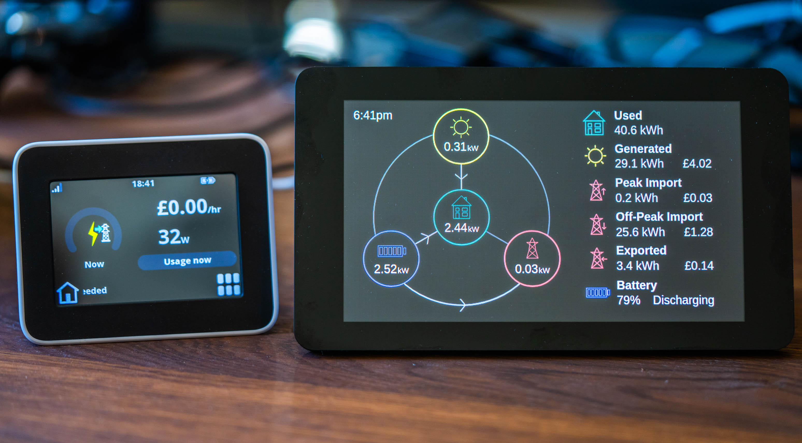
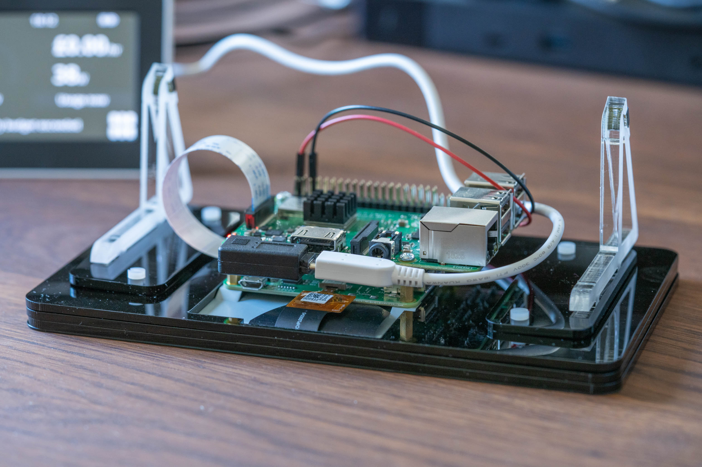

# GivEnergy Smart Home Display



## Introduction

This is a web-based application for showing a live summary of energy data from a GivEnergy inverter. It is designed
to run on a Raspberry Pi (in Chromium) and sized for rendering on a HyperPixel 4 display (a low-cost TFT screen that
attaches directly to the Pi) when loaded in Chromium in fullscreen mode.

## Web Application

The user interface of the web app is rendered completely using SVG. The only external dependencies for the user interface
are a little use of jQuery. The rest of the app consists of raw JavaScript and CSS.

Data is obtained from the inverter by using GivTCP on the local network and this is captured using a local Home Assistant
server. The user interface of the smart home display web app grabs the data from this Home Assistant server (using a
WebSocket connection). 

The reason Home Assistant is used is it offers various energy-monitoring capabilities and automatic tariff switching, 
and can help store energy usage data throughout the day and calculate the usage costs (taking into account the usage
during different parts of the day - i.e. peak vs. off-peak).

## Prerequisites

Hardware prerequisites:

- **[GivEnergy inverter](https://www.givenergy.co.uk/)** - you obviously need a GivEnergy inverter connected to
  your local home network :)
- **Raspberry Pi 3/4** - for loading this GivEnergy smart home display web app. You may also choose to install the software
  dependencies (below) on the Pi
- **[HyperPixel 4 TFT display (non-touch version)](https://shop.pimoroni.com/products/hyperpixel-4?variant=12569539706963)** - 
  for attaching to the Raspberry Pi board. The display is compatible with all 40-pin header Raspberry Pi models

Software prerequisites:

- **[Home Assistant](https://www.home-assistant.io/)** - running on the same local network (e.g. on a Raspberry Pi or 
  home server)
- **[GivTCP](https://github.com/GivEnergy/giv_tcp)** - this connects directly to your GivEnergy inverter and provides 
  realtime data via an MQTT broker that Home Assistant is able to read. This needs to be running on the same local 
  network as your inverter (e.g. on a Raspberry Pi or home server)

## Hardware Setup

The HyperPixel 4 display attaches directly to the Raspberry Pi board using the included 40-pin header extension and 
standoffs.



## Software Setup

1. Follow the installation instructions for [GivTCP](https://github.com/GivEnergy/giv_tcp) and set this up somewhere on 
   your local network so that it's running 24/7. This runs inside a Docker container.
2. Once GivTCP is setup, you will need to define a few settings inside the `docker-compose.yml`:
    1. `INVERTOR_IP` - set the IP address of your GivEnergy inverter (assign a static IP to the inverter via your router if possible)
    2. `NUM_BATTERIES` - set the number of batteries connected to your GivEnergy inverter
    3. `MQTT_OUTPUT` - set this to `True` so Home Assistant is able to retrieve inverter data at regular intervals
3. If you don't already have [Home Assistant](https://www.home-assistant.io/), you will need to install this on a device
   on your local network, such as a Raspberry Pi, home server, or NAS device. This can also run inside of Docker.
4. In Home Assistant, go to Configuration >> Devices & Services >> Integrations. Click on Add Integration, and search
   for MQTT. In the settings for MQTT you will need to define the Broker options - this will be the IP address of the
   device running GivTCP. If this is on the same device as Home Assistant you can use `127.0.0.1`. Also set the port number,
   e.g. `1883`. This should detect all the different power and energy metrics provided by the GivEnergy inverter.
5. In the `configuration.yaml` for Home Assistant, you will need to enable the Utility Meter (for defining your tariffs),
   and create some sensors that the web app requires. Here are the full contents of my `configuration.yaml` as an
   example. You will also need to change the peak and off-peak tariff rates in the code below.

```yaml
default_config:

tts:
  - platform: google_translate

utility_meter:
  daily_energy:
    source: sensor.override_import_energy_today_kwh
    name: Daily Energy
    cycle: daily
    tariffs:
      - peak
      - offpeak

script: !include scripts.yaml
scene: !include scenes.yaml
automation: !include automations.yaml

sensor:
  - platform: template
    sensors:
      override_import_energy_today_kwh:  # Sometimes GivTCP returns a 0 kWh import energy reading, causing Home Assistant to double up the numbers when it returns to normal
        unit_of_measurement: kWh
        friendly_name: Import Energy Today kWh
        value_template: >
          
          
            {{ states('sensor.override_import_energy_today_kwh') }}
          
            {{ value }}
          

  - platform: template
    sensors:
      daily_energy_cost_peak:
        unit_of_measurement: '£'
        friendly_name: Today's Peak Tariff Cost
        value_template: "{{ (states('sensor.daily_energy_peak') | float * 0.138 ) | round(2) }}"  # Define peak tariff rate here

  - platform: template
    sensors:
      daily_solar_generated_income:
        unit_of_measurement: '£'
        friendly_name: Today's Generated Solar Income
        value_template: "{{ (states('sensor.givtcp_pv_energy_today_kwh') | float * 0.138 ) | round(2) }}"  # Define peak tariff rate here

  - platform: template
    sensors:
      daily_energy_cost_offpeak:
        unit_of_measurement: '£'
        value_template: "{{ (states('sensor.daily_energy_offpeak') | float * 0.05 ) | round(2) }}"  # Define off-peak tariff rate
        friendly_name: Today's Off-Peak Tariff Cost

  - platform: template
    sensors:
      daily_energy_cost_all:
        unit_of_measurement: '£'
        value_template: "{{ (states('sensor.daily_energy_cost_peak') | float) + (states('sensor.daily_energy_cost_offpeak') | float) }}"
        friendly_name: Today's Total Cost

  - platform: template
    sensors:
      daily_energy_export_income:
        unit_of_measurement: '£'
        value_template: "{{ (states('sensor.givtcp_export_energy_today_kwh') | float * 0.041 ) | round(2) }}"  # Define export tariff rate
        friendly_name: Today's Export Income

  - platform: template
    sensors:
      battery_state:
        value_template: >-
           Discharging
           Charging
           Idle
          
        friendly_name: Battery State
```

6. The `configuration.yaml` also references `automations.yaml` - create this file if it doesn't exist, and
   define the automations to ensure Home Assistant automatically switches tariffs at the appropriate times. For
   example I am on the Octopus Go tariff from Octopus Energy, which has an off-peak period of 12:30am to 4:30am:

```yaml
- alias: Switch to off-peak tariff
  trigger:
  - platform: time
    at: "00:30:00"
  condition: []
  action:
  - service: utility_meter.select_tariff
    data:
      tariff: offpeak
    target:
      entity_id: utility_meter.daily_energy
  mode: single
  id: offpeak1

- alias: Switch to peak tariff
  trigger:
  - platform: time
    at: "04:30:00"
  condition: []
  action:
  - service: utility_meter.select_tariff
    data:
      tariff: peak
    target:
      entity_id: utility_meter.daily_energy
  mode: single
  id: peak1
```

7. The automations above will create triggers to automatically switch the tariff at the appropriate times, ensuring
   Home Assistant correctly calculates your energy costs throughout the day. **Important:** Check to make sure Home Assistant
   is set to the right timezone (e.g. London). If it's set to UTC for example, the tariff will
   switch at the wrong time. You can check the timezone setting under Configuration >> Settings >> General.
8. In Configuration >> Dashboards >> Energy, configure the sensors for Electricity grid, Solar panels, and Home battery storage.
   I used these settings:
    1. Grid consumption - `GivTCP Import Energy Today kWh`
    2. Return to grid - `GivTCP Export Energy Today kWh`
    3. Solar production - `GivTCP PV Energy Today kWh`
    4. Battery systems:
        1. Energy going in to the battery - `GivTCP Battery Charge Energy Today kWh`
        2. Energy coming out of the battery - `GivTCP Battery Discharge Energy Today kWh`
9. Restart Home Assistant and you should soon see data under the Overview and Energy sections.
10. Generate a Long-Lived Access Token within Home Assistant, via your User Profile screen >> Long-Lived Access Tokens. 
   This is required by the GivEnergy smart home display web app.
11. Store the access token in `app.json`.
12. Set the domain (and port number) of your Home Assistant server in `app.json`.
13. Boot the Raspberry Pi, attach it to the local network, and launch the web app manually in the Chromium browser (you
can serve it using a local web server on the Pi, e.g. using [`serve`](https://www.npmjs.com/package/serve)).

## Current Issues and Limitations

- There is normally a ~15% disparity between the reported battery discharge rate (`givtcp_discharge_power`) and the 
load rate (`givtcp_load_power`), for example the battery may show a discharge rate of 1.6 kW, but the house is only 
using 1.4 kW. Do the GivEnergy team know why this might be happening? Is it simply the loss of converting DC to AC, 
or an issue with GivTCP?
- Sometimes the arrows show power flow, when the sources (e.g. grid) are 0.00 kW - need to zero-out these values

## Upcoming Plans

Here are the upcoming plans for this smart home display app:

- Have all the dependencies container-based, making it easier and quicker to set everything up on the Raspberry Pi, 
without needing to setup external dependencies
- Preconfigure as many dependencies as possible, to minimise the number of configuration steps
- Add error handling (show friendly errors) when things go wrong, e.g. wrong URL, no access token, etc.
- Automatically launch the web app in Chromium full screen mode when the Raspberry Pi boots
- Implement a power saving mode to allow the user to define the hours when the screen is powered off
- Incorporate the smart display inside a 3D-printed desk enclosure (there are some existing designs for housing a 
Pi and the HyperPixel 4 screen on Thingiverse)

## Other Notes

- SVG icons were designed and generated using https://yqnn.github.io/svg-path-editor/